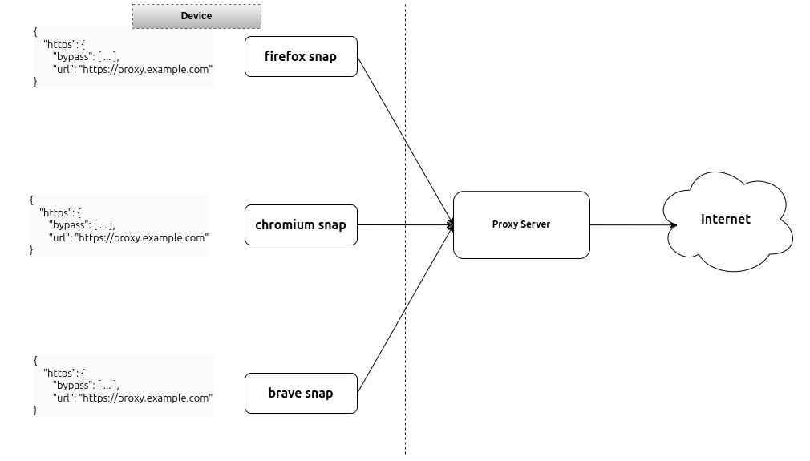
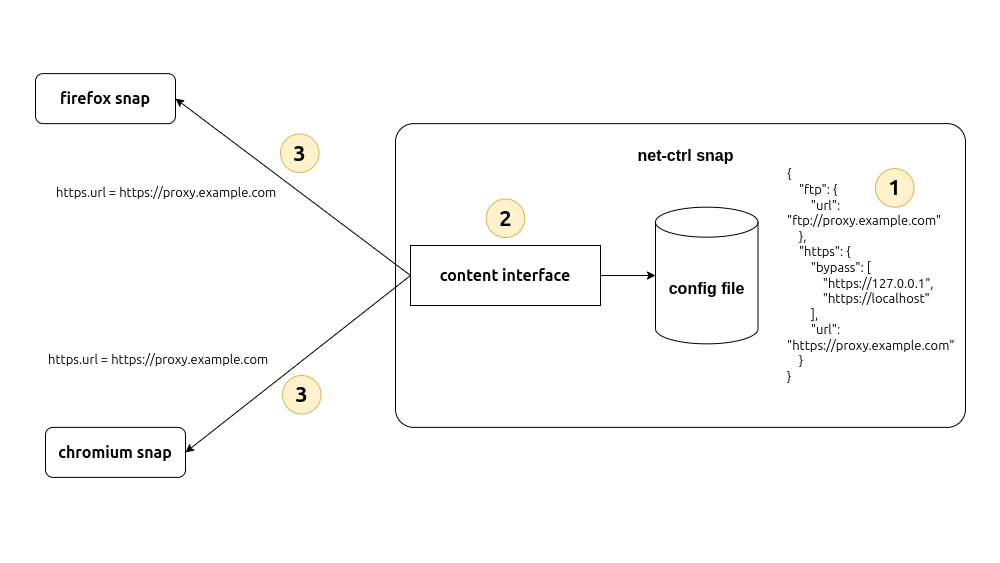
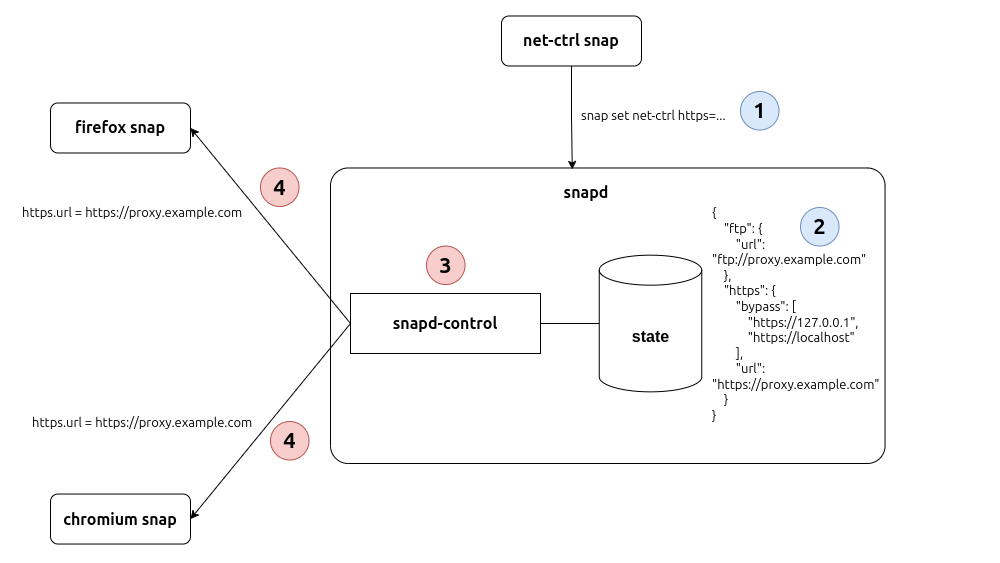
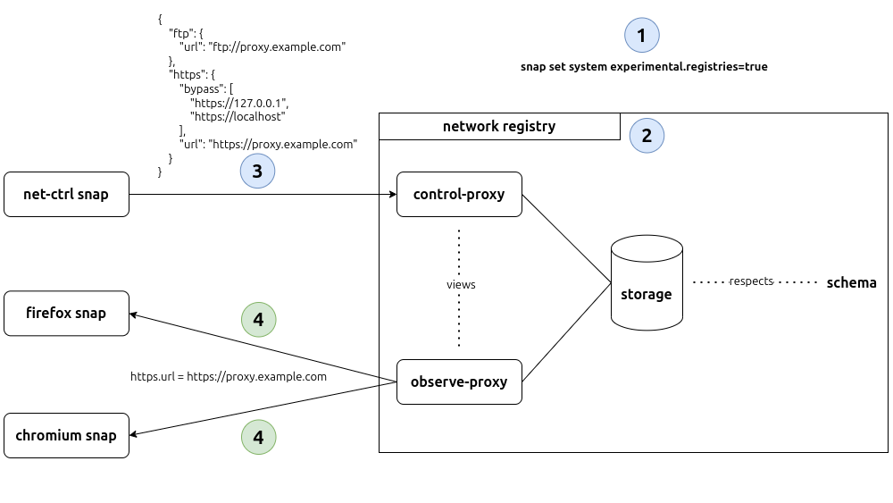

# A Confdb Demo

Confdbs provide a new mechanism for configuring snaps in the snappy ecosystem. They enable configuration sharing between snaps while maintaining security and proper access control.

For this demo, we'll set up a `network` confdb to share proxy configuration between snaps.

> [!WARNING]
> Confdbs were previously called registries and aspects before that. Snapcraft has not caught up with this rename yet.
> For now, the `snapcraft` bits might not work as the commands are available under the `-registries` name.

## The Past

Traditionally, snap configuration has been tightly coupled to individual snaps, making it difficult to share configuration between snaps. In this example, each of the snaps (Firefox, Chromium, & Brave) have their own proxy config set through `snap set` which leads to a lot of duplication.



We'll look at several (somewhat hacky) workarounds to get around this and how confdbs can fix this.

### _content_ interface

In this scenario, we'll create an additional snap (`net-ctrl`) that will store the configuration in a file. It exposes this file to the other snaps over the [content interface](https://snapcraft.io/docs/content-interface).



### _snapd-control_ interface

In this scenario, we also have an additional snap (`net-ctrl`) that we set snap config on (with `snap set`). The other snaps then connect to the [snapd-control](https://snapcraft.io/docs/snapd-control-interface) and consume this configuration through the snapd API endpoint [`/v2/snaps/net-ctrl/conf`](https://snapcraft.io/docs/snapd-api#heading--snaps-name-conf). This is a BAD solution as it effectively grants these snaps `root` access to your device which isn't safe.



## Using Confdbs

### Intro

Confdbs separate snaps from their configuration, enabling easier cross-snap configuration sharing.\
A confdb is defined using a `confdb` assertion which looks like this:

```yaml
type: confdb
authority-id: <account-id>
account-id: <account-id>
name: <string>
views:
  <view-name>:
    rules:
      -
        request: <string>
        storage: <string>
        access: read|write|read-write # the default is read-write
        content:
          -
            request: <string>
            storage: <string>
            ...
  ...
timestamp: <date -Iseconds --utc>

{
  "storage": {
    "aliases": {
      ...
    },
    "schema": {
      ...
    }
  }
}

<signature>
```

Snaps do not act on the the raw configuration in the storage directly. This is mediated by confdb views which allows the views & storage to evolve independently.

We'll create two views: `control-proxy` and `observe-proxy`. `control-proxy` allows for `read-write` access but `observe-proxy` only allows `read` access. This is the naming convention in confdbs.

```yaml
views:
  control-proxy:
    rules:
      -
        request: {protocol}
        storage: proxy.{protocol}
        content:
          -
            request: url
            storage: url
            access: read-write
          -
            request: bypass
            storage: bypass
  observe-proxy:
    rules:
      -
        request: https
        storage: proxy.https
        access: read
      -
        request: ftp
        storage: proxy.ftp
        access: read
```

Each view has a set of rules that hold the `request` path, the underlying `storage`, and the `access` method. You can use placeholders in the `request` and `storage`. In the example above, `{protocol}` is a placeholder which maps to `proxy.{protocol}`. For instance, `https` -> `proxy.https`.

The stored config respects the following schema:

```json
{
  "storage": {
    "aliases": {
      "protocol": {
        "choices": [
          "http",
          "https",
          "ftp"
        ],
        "type": "string"
      }
    },
    "schema": {
      "proxy": {
        "keys": "$protocol",
        "values": {
          "schema": {
            "bypass": {
              "type": "array",
              "unique": true,
              "values": "string"
            },
            "url": "string"
          }
        }
      }
    }
  }
}
```

In a diagram, this setup looks like this:



The `net-ctrl` snap acts as the custodian of the confdb view. A custodian snap can validate the view data being written using [hooks](https://snapcraft.io/docs/supported-snap-hooks) such as `change-view-<plug>`.\
The other snaps are called "observers" of the confdb view. They can use `<plug>-view-changed` hooks to watch changes to the view. This could be useful for the snaps to update their own config and/or restart runnning services.\
A snap can be an observer & custodian of many different views.

The roles are defined as plugs in the respective snap's `snapcraft.yaml`. Like so:

**net-ctrl** (custodian)

```yaml
plugs:
  proxy-control:
    interface: confdb
    account: <account-id>
    view: network/control-proxy
    role: custodian
```

**browser** (observer)

```yaml
plugs:
  proxy-observe:
    interface: confdb
    account: <account-id>
    view: network/observe-proxy
```

### Create a `confdb` Assertion

The confdbs feature is currently behind an experimental flag & you need to run `snap set system experimental.confdbs=true` to enable it.

You can create a confdb assertion "by hand" where you sign it yourself or you can use `snapcraft` which launches an editor to type the assertion in, then it signs the assertion & uploads it to the Store (see [this addendum](#creating-a-confdb-assertion-with-snapcraft)).

Create a `network-confdb.json` file and put your assertion there. The `body` must be in a _very specific_ format so run your json through `jq` like so: `echo '{...}' | jq -S | jq -sR`.

#### Sign & Acknowledge

Next, we'll sign the assertion, save the signed version in a `.assert` file, and finally acknowledge it.

```console
$ snap sign -k <key-name> network-confdb.json > network-confdb.assert
$ snap ack network-confdb.assert
```

###### Errors You Might Encounter

**cannot resolve prerequisite assertion**

This error occurs when trying to acknowledge the assertion but some requisite assertions are not found on the system. We'll need to fetch them from the Store.

To fetch and acknowledge the `account` assertion, run:

```console
$ snap known --remote account account-id=<account-id> > /tmp/account.assert
$ snap ack /tmp/account.assert
```

To fetch and acknowledge the `account-key` assertion, run:

```console
$ snap known --remote account-key public-key-sha3-384=<key-sha-digest> > /tmp/account-key.assert
$ snap ack /tmp/account-key.assert
```

> [!TIP]
> To get the `key-sha-digest`, run `snap keys` and pick it from the `SHA3-384` column.

Finally, `ack` the confdb assertion itself.

### Build & Install Snaps

Next, we'll build and install the `net-ctrl` and `browser` snaps in this repository.

#### net-ctrl snap

```console
$ cd net-ctrl
$ snapcraft
Packed net-ctrl_0.1_amd64.snap

$ snap install net-ctrl_0.1_amd64.snap --dangerous
net-ctrl 0.1 installed
```

#### browser snap

```console
$ cd browser
$ snapcraft
Packed browser_0.1_amd64.snap

$ snap install browser_0.1_amd64.snap --dangerous
browser 0.1 installed
```

### Interfaces

Next, we'll connect the interfaces for both snaps.

```console
$ snap connect net-ctrl:proxy-control
$ snap connections net-ctrl
Interface  Plug                    Slot       Notes
confdb     net-ctrl:proxy-control  :confdb  manual

$ snap connect browser:proxy-observe
$ snap connections browser
Interface  Plug                   Slot       Notes
network    browser:network        :network   -
confdb     browser:proxy-observe  :confdb  manual
```

### Setting & Reading the Config

#### With `snapctl`

Confdb views can only be set if there is at least one snap on the system with a "custodian" role plug for that view.

The commands take the form:
  - `snapctl set --view :<view-name> <dotted.path>=<value>`
  - `snapctl get --view :<view-name> [<dotted.path>] [-d]`

```console
$ sudo net-ctrl.sh -c 'snapctl set --view :proxy-control https.url=https://proxy.example.com'
$ sudo net-ctrl.sh -c 'snapctl set --view :proxy-control ftp.url=ftp://proxy.example.com'

$ snap run --shell browser
# snapctl get --view :proxy-observe
{
    "ftp": {
        "bypass": [
            "*://*.company.internal"
        ],
        "url": "ftp://proxy.example.com"
    },
    "https": {
        "bypass": [
            "localhost",
            "*://*.company.internal"
        ],
        "url": "https://proxy.example.com"
    }
}
# snapctl get --view :proxy-observe https
{
    "bypass": [
        "localhost",
        "*://*.company.internal"
    ],
    "url": "https://proxy.example.com"
}
```

#### With `snap set`

The commands take the form:
  - `snap set <account-id>/<confdb>/<view> <dotted.path>=<value>`
  - `snap get <account-id>/<confdb>/<view> [<dotted.path>] [-d]`

```console
$ snap set f22PSauKuNkwQTM9Wz67ZCjNACuSjjhN/network/control-proxy 'https.bypass=["https://127.0.0.1", "https://localhost"]'

$ snap get f22PSauKuNkwQTM9Wz67ZCjNACuSjjhN/network/observe-proxy ftp
Key         Value
ftp.bypass  [*://*.company.internal]
ftp.url     ftp://proxy.example.com
$ snap get f22PSauKuNkwQTM9Wz67ZCjNACuSjjhN/network/observe-proxy ftp -d
{
    "ftp": {
        "bypass": [
            "*://*.company.internal"
        ],
        "url": "ftp://proxy.example.com"
    }
}
$ snap get f22PSauKuNkwQTM9Wz67ZCjNACuSjjhN/network/control-proxy ftp.url
ftp://proxy.example.com
```

## Hooks

A [hook](https://snapcraft.io/docs/supported-snap-hooks) is an executable file that runs within a snap's confined environment when a certain action occurs.\
Snaps can implement hooks to manage and observe confdb views. The hooks are `change-view-<plug>`, `save-view-<plug>`, `load-view-<plug>`, `query-view-<plug>`, & `<plug>-view-changed`. For this demo, we'll look at `change-view-<plug>` and `<plug>-view-changed`.

### browser/proxy-observe-view-changed (`<plug>-view-changed`)

This hook allows the browser snap to watch for changes to the `observe` proxy view. It outputs the new config to `$SNAP_COMMON/new-config.json`.

```console
$ sudo net-ctrl.sh -c 'snapctl set --view :proxy-control https.url="http://localhost:3199/"'
$ snap changes
ID   Status  Spawn                     Ready                     Summary
[...]
765  Done    today at 15:36 CET        today at 15:36 CET        Modify confdb "f22PSauKuNkwQTM9Wz67ZCjNACuSjjhN/network"
$ snap tasks 765
Status  Spawn               Ready               Summary
Done    today at 15:36 CET  today at 15:36 CET  Clears the ongoing confdb transaction from state (on error)
Done    today at 15:36 CET  today at 15:36 CET  Run hook change-view-proxy-control of snap "net-ctrl"
Done    today at 15:36 CET  today at 15:36 CET  Run hook proxy-observe-view-changed of snap "browser"
Done    today at 15:36 CET  today at 15:36 CET  Commit changes to confdb "f22PSauKuNkwQTM9Wz67ZCjNACuSjjhN/network"
Done    today at 15:36 CET  today at 15:36 CET  Clears the ongoing confdb transaction from state
$ cat /var/snap/browser/common/new-config.json
{
    "ftp": {
        "bypass": [
            "*://*.company.internal"
        ],
        "url": "ftp://proxy.example.com"
    },
    "https": {
        "bypass": [
            "https://127.0.0.1",
            "https://localhost",
            "*://*.company.internal"
        ],
        "url": "http://localhost:3199/"
    }
}
```

### net-ctrl/change-view-proxy-control (`change-view-<plug>`)

This hook:
1. Validates the `{protocol}.url` (data validation), and
2. Ensures that internal company URLs are never proxied (data decoration).

#### Example 1: Validation

```console
$ sudo net-ctrl.sh -c 'snapctl set --view :proxy-control https.url="not a url?"'
$ snap changes
ID   Status  Spawn                     Ready                     Summary
[...]
766  Error   today at 15:38 CET        today at 15:38 CET        Modify confdb "f22PSauKuNkwQTM9Wz67ZCjNACuSjjhN/network"
$ snap tasks 766
Status  Spawn               Ready               Summary
Undone  today at 15:38 CET  today at 15:38 CET  Clears the ongoing confdb transaction from state (on error)
Error   today at 15:38 CET  today at 15:38 CET  Run hook change-view-proxy-control of snap "net-ctrl"
Hold    today at 15:38 CET  today at 15:38 CET  Run hook proxy-observe-view-changed of snap "browser"
Hold    today at 15:38 CET  today at 15:38 CET  Commit changes to confdb "f22PSauKuNkwQTM9Wz67ZCjNACuSjjhN/network"
Hold    today at 15:38 CET  today at 15:38 CET  Clears the ongoing confdb transaction from state

......................................................................
Run hook change-view-proxy-control of snap "net-ctrl"

2024-10-30T17:38:59+03:00 ERROR run hook "change-view-proxy-control": failed to validate url: not a url?
```

#### Example 2: Decoration

```console
$ sudo snap run --shell net-ctrl.sh
# snapctl set --view :proxy-control 'https.bypass=["localhost"]'
# snapctl get --view :proxy-control
{
    "ftp": {
        "bypass": [
            "*://*.company.internal"
        ],
        "url": "ftp://proxy.example.com"
    },
    "https": {
        "bypass": [
            "localhost",
            "*://*.company.internal"
        ],
        "url": "http://localhost:3199/"
    }
}
```

## Addendum

### Creating a Confdb Assertion with Snapcraft

Register for an Ubuntu One (staging) account [here](https://login.staging.ubuntu.com/) and for a Store (staging) account [here](https://dashboard.staging.snapcraft.io/).

At the time of writing, creating a confdb assertion with snapcraft was still in beta so we need to install from the beta channel:

```console
$ snap install snapcraft --beta --classic

# or if already installed
$ snap refresh snapcraft --beta
```

We need to use staging since the confdbs API is disabled on production:

```console
$ snapcraft edit-confdbs <account-id> network --key-name=<key-name>
Store operation failed:
- feature-disabled: Confdb API is disabled
```

#### Login

```console
$ export UBUNTU_ONE_SSO_URL="https://login.staging.ubuntu.com"
$ export STORE_DASHBOARD_URL="https://dashboard.staging.snapcraft.io"
$ snapcraft login
```

#### Setup Keys

```console
$ snapcraft create-key <key-name>
$ snapcraft register-key <key-name>
```

#### Create a New Confdb

```console
$ snapcraft whoami
email: <email>
username: <username>
id: <account-id>
permissions: package_access, package_manage, package_metrics, package_push, package_register, package_release, package_update
channels: no restrictions
expires: 2025-10-25T08:38:11.000Z

$ snapcraft edit-confdbs <account-id> network --key-name=<key-name>
Successfully created revision 1 for 'network'.

$ snapcraft list-confdbs
Account ID                        Name      Revision  When
<account-id>                      network          1  2024-10-2
```

#### API

The API documentation is available [here](https://dashboard.staging.snapcraft.io/docs/reference/v2/en/confdbs.html).\
Install [surl](https://snapcraft.io/surl) to interact with it.

```console
$ surl -a staging -s staging -e <email>
{
  "account": {
    "id": "<account-id>",
    "email": "<email>",
    "username": "<username>",
    "name": "<your name>"
  },
  "channels": null,
  "packages": null,
  "permissions": [
    "package_access"
  ],
  "store_ids": null,
  "expires": "2025-04-23T00:00:00.000",
  "errors": []
}

$ surl -a staging https://dashboard.staging.snapcraft.io/api/v2/confdbs | jq
{
  "assertions": [
    {
      "headers": {
        "account-id": "<account-id>",
        "authority-id": "<account-ids>",
        "body-length": "92",
        "name": "network",
        "revision": "1",
        "sign-key-sha3-384": "RFxSEcXp9jocWM85Hm9m62JOtXKvu1k5toUXUZ6RGw20Md3WlZaf7P-SpZ_ed1wD",
        "timestamp": "2024-10-25T08:55:22Z",
        "type": "confdb",
        "views": {
          "wifi-setup": {
            "rules": [
              {
                "access": "write",
                "request": "ssids",
                "storage": "wifi.ssids"
              }
            ]
          }
        }
      },
      "body": "{\n  \"storage\": {\n    \"schema\": {\n      \"wifi\": {\n        \"values\": \"any\"\n      }\n    }\n  }\n}"
    }
  ]
}
```

To fetch the full signed assertion, run:

```console
$ curl --silent --header "Accept: application/x.ubuntu.assertion" https://assertions.staging.ubuntu.com/v1/assertions/confdb/<account-id>/<confdb-name>
type: confdb
authority-id: 10ptdA3uXGo7P7DCvMk9wSgKnHiYKEV0
revision: 1
account-id: 10ptdA3uXGo7P7DCvMk9wSgKnHiYKEV0
name: net
timestamp: 2024-10-25T08:55:22Z
views:
  wifi-setup:
    rules:
      -
        access: write
        request: ssids
        storage: wifi.ssids
body-length: 92
sign-key-sha3-384: RFxSEcXp9jocWM85Hm9m62JOtXKvu1k5toUXUZ6RGw20Md3WlZaf7P-SpZ_ed1wD

{
  "storage": {
    "schema": {
      "wifi": {
        "values": "any"
      }
    }
  }
}

AcLBcwQAAQoAHRYhBL09/H3Nqvu18UELh5IhgQJaoqEDBQJnG1z7AAoJEJIhgQJaoqEDmLIQAKYT
veCnwPt3oLtX0m6gcHxr7ggyhIoMNGfe7jx2v64kI8ZrgLYM/rhEUnBKce4oG3tVpRBDfh2UttQq
pixb0PCwsSgpIhRqP+bzcxcff7py+PidKxEobLjGRVMMQVT4dQJw3LqgKMTqmPVqNgXszoFViKLH
7UAWannUanE0CbckBFq5t1aunPH4KXXeW1DW1CCJlpRLaWZwqPQNM/EEEC2KQU6PoyE94VU2Jdm2
6DiBEjENo2mcEWWuQXuTa9L4OsbtU3c3PbO3s5SlNd+jraGof4c1L58kzDE7hpxBI/1pGCF9172u
aPbCEav8N9FNfRifIi2hj/IgSS4vyrnSW4jrB7wfTYRu8PiltQeIqV1kfwO3xFtigHggBAsL/jK/
ISKUA6h5EAc2yG7y5xEE4SaXGmWoQ3YaeR4RNQHx9NjJ5MQKYtpprtfpPZUc9JMfRMSIMPFG1EM+
ldfd4UWQYYQdnWrZc5PRlBlC7K4wTVOaF6BSduAX38ZM8EOPcc3Mf18Fj5uHOpW4PDOynQ6Lb8k3
yidmyylvvmpB0DS1e3xLY2PNHMwZ9/UsO3kzegUIMSCVixn3vXbFx91W4GU2tVFi5jW35xkvx0nk
xOAyEc2EBedXwu57XuIELIleoNm5+SUqAG9X97z/m8w6qHww57Lpwd8fEADgNDanDDNhtfZG
```

### Checking if the `browser` snap works

Run the web proxy on the host (`proxy.example.com`) or locally in a docker container:

```console
$ docker run -d --name squid-container -e TZ=UTC -p 3128:3128 ubuntu/squid:5.2-22.04_beta
```

Point the `http/https` proxy config to the web proxy and then call `browser` with a proxied URL:

```console
$ sudo net-ctrl.sh -c 'snapctl set --view :proxy-control https.url="http://localhost:3128/"'
$ browser "https://example.com"

╭──────────────────────────────────────────────────────────────────────────────────────────────╮
│                                        Example Domain                                        │
╰──────────────────────────────────────────────────────────────────────────────────────────────╯


This domain is for use in illustrative examples in documents. You may use this domain in
literature without prior coordination or asking for permission.


More information... (https://www.iana.org/domains/example)

```

Check the proxy's logs and verify that the HTTP calls were indeed proxied:

```console
$ docker logs -f squid-container
[...]
1729879108.361   2812 172.17.0.1 TCP_TUNNEL/200 5435 CONNECT example.com:443 - HIER_DIRECT/93.184.215.14 -
1729879154.849   1618 172.17.0.1 TCP_TUNNEL/200 5458 CONNECT example.com:443 - HIER_DIRECT/93.184.215.14 -
```

### Further Reading

- SD133 Specification: Confdbs and views
