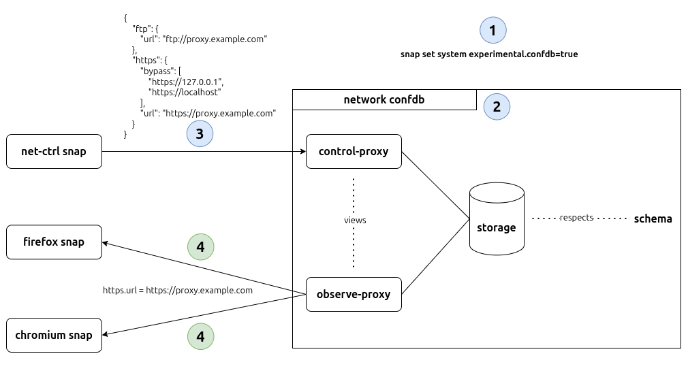

# A Confdb Demo

Confdbs provide a new mechanism for configuring snaps in the snappy ecosystem. They enable configuration sharing between snaps while maintaining security and proper access control.

For this demo, we'll set up a `network` confdb to share proxy configuration between snaps.

> [!TIP]
> Make sure you're running the latest versions of `snapd` & `snapcraft` (from `stable`). \
> If something doesn't work, try installing the snaps from the `beta` or `edge` channels: \
> `snap refresh snapd --edge` / `snap refresh snapcraft --edge`

## The Past

Traditionally, snap configuration has been tightly coupled to individual snaps, making it difficult to share configuration between snaps. In this example, each of the snaps (Firefox, Chromium, and Brave) have their own proxy configuration set through `snap set` which leads to a lot of duplication.


We'll look at several hacky workarounds to get around this and how using a confdb can fix this.

### _content_ interface

In this workaround, we'll create an additional snap (`net-ctrl`) that will store the configuration in a file. It exposes this shared file to the other snaps over the [content interface](https://snapcraft.io/docs/content-interface).


### _snapd-control_ interface

In this workaround, we also have an additional snap (`net-ctrl`) that we set snap config on (with `snap set`). The other snaps then connect to the [snapd-control](https://snapcraft.io/docs/snapd-control-interface) interface and consume this configuration through the snapd API endpoint [`/v2/snaps/net-ctrl/conf`](https://snapcraft.io/docs/snapd-api#heading--snaps-name-conf). This is a BAD solution as it effectively grants these snaps `root` access to your device which isn't safe.


## Using Confdbs

### Intro

Confdbs separate snaps from their configuration, enabling easier cross-snap configuration sharing. A confdb is defined using a [`confdb-schema` assertion](https://documentation.ubuntu.com/core/reference/assertions/confdb-schema/) which looks like this:

```yaml
type: confdb-schema
authority-id: <your-account-id>
account-id: <your-account-id>
revision: <N> # Bump this to <N+1> after changing the assertion
name: <string>
views:
  <view-name>:
    rules:
      -
        request: <string>
        storage: <string>
        access: read|write|read-write # the default is read-write
        content:
          -
            request: <string>
            storage: <string>
            ...
  ...
timestamp: <date -Iseconds --utc>

{
  "storage": {
    "aliases": {
      ...
    },
    "schema": {
      ...
    }
  }
}

<signature>
```

Snaps do not act on the raw configuration in the storage directly. This is mediated by confdb views which allows the views & storage to evolve independently.

We'll create two views: `control-proxy` and `observe-proxy`. `control-proxy` allows for `read-write` access but `observe-proxy` only allows `read` access.

```yaml
views:
  control-proxy:
    rules:
      -
        request: {protocol}
        storage: proxy.{protocol}
        content:
          -
            request: url
            storage: url
            access: read-write
          -
            request: bypass
            storage: bypass
  observe-proxy:
    rules:
      -
        request: https
        storage: proxy.https
        access: read
      -
        request: ftp
        storage: proxy.ftp
        access: read
```

Each view has a set of rules that hold the `request` path, the underlying `storage`, and the `access` method. You can use placeholders in the `request` and `storage`. In the example above, `{protocol}` is a placeholder which maps to `proxy.{protocol}`. For instance, `https` maps to `proxy.https`.

The stored config respects the following schema:

```json
{
  "storage": {
    "aliases": {
      "protocol": {
        "choices": [
          "http",
          "https",
          "ftp"
        ],
        "type": "string"
      }
    },
    "schema": {
      "proxy": {
        "keys": "string",
        "values": {
          "schema": {
            "bypass": {
              "type": "array",
              "unique": true,
              "values": "string"
            },
            "url": "string"
          }
        }
      }
    }
  }
}
```

In a diagram, this setup looks like this:



The `net-ctrl` snap acts as the custodian of the confdb view. A custodian snap can validate the view data being written using [hooks](https://snapcraft.io/docs/supported-snap-hooks) such as `change-view-<plug>`.\
The other snaps are called "observers" or "readers" of the confdb view. They can use `observe-view-<plug>` hooks to watch changes to the view. This could be useful for the snaps to update their own config and/or restart runnning services after config changes.\
A snap can be an observer and custodian of many different views.

The roles are defined as plugs in the respective snap's `snapcraft.yaml` like so:

**net-ctrl** (custodian)

```yaml
plugs:
  proxy-control:
    interface: confdb
    account: <your-account-id>
    view: network/control-proxy
    role: custodian

  proxy-observe:
    interface: confdb
    account: <your-account-id>
    view: network/observe-proxy
    role: custodian
```

> [!IMPORTANT]
> Here, `net-ctrl` is the custodian for both `proxy-control` & `proxy-observe`. This is because a view must have at least one custodian snap.

**browser** (observer/reader)

```yaml
plugs:
  proxy-observe:
    interface: confdb
    account: <your-account-id>
    view: network/observe-proxy
```

> [!Note]
> For observer/reader snaps, the role is implicit so you don't have to specify it.

### Create a `confdb-schema` Assertion

The confdbs feature is currently behind an experimental flag and you need to run `snap set system experimental.confdb=true` to enable it.

> [!NOTE]
> Since confdb is an experimental feature, the implementation details may change as development progresses.

You can create a confdb-schema assertion with `snapcraft` which launches an editor to type the assertion in, then it signs the assertion & uploads it to the Store. Alternatively, you can do this "by hand" where you sign it yourself (see [this addendum](#creating-a-confdb-schema-assertion-by-hand)).

#### Prerequisites

If you do not have any snapcraft keys, create one and register it with the Store.

```console
$ snapcraft login   # if not already logged in
$ snapcraft whoami  # confirm
email: <email>
username: <username>
id: <your-account-id>
permissions: package_access, package_manage, package_metrics, package_push, package_register, package_release, package_update
channels: no restrictions
expires: 2025-10-25T08:38:11.000Z

$ snapcraft create-key <key-name>
$ snapcraft register-key <key-name>
```

### Create, Sign, & Upload to Store

Next, run `snapcraft edit-confdb-schema` which launches you into an editor where you can fill in the assertion's details.

```console
$ snapcraft edit-confdb-schema <your-account-id> network --key-name=<key-name>
Successfully created revision 1 for 'network'.

$ snapcraft list-confdb-schemas
Account ID                        Name      Revision  When
<your-account-id>                 network          1  2024-10-2
```

### Build & Install Snaps

Next, we'll build and install the `net-ctrl` and `browser` snaps in this repository.

#### net-ctrl snap

```console
$ cd net-ctrl
$ snapcraft
Packed net-ctrl_0.1_amd64.snap

$ snap install net-ctrl_0.1_amd64.snap --dangerous
net-ctrl 0.1 installed
```

#### browser snap

```console
$ cd browser
$ snapcraft
Packed browser_0.1_amd64.snap

$ snap install browser_0.1_amd64.snap --dangerous
browser 0.1 installed
```

### Interfaces

Next, we'll connect the [interfaces](https://snapcraft.io/docs/confdb-interface) for both snaps.

```console
$ snap connect net-ctrl:proxy-control
$ snap connect net-ctrl:proxy-observe
$ snap connections net-ctrl
Interface  Plug                    Slot     Notes
confdb     net-ctrl:proxy-control  :confdb  manual
confdb     net-ctrl:proxy-observe  :confdb  manual

$ snap connect browser:proxy-observe
$ snap connections browser
Interface  Plug                   Slot      Notes
confdb     browser:proxy-observe  :confdb   manual
network    browser:network        :network  -
```

> [!NOTE]
> For snaps installed from the Store, if the assertion's `account-id` is the same as the snap publisher, the interfaces should be connected automatically.

### Setting & Reading the Config

#### With `snapctl`

Confdb views can only be set if there is at least one snap on the system with a "custodian" role plug for that view.

The commands take the form:
  - `snapctl set --view :<view-name> <dotted.path>=<value>`
  - `snapctl get --view :<view-name> [<dotted.path>] [-d]`

```console
$ sudo net-ctrl.sh -c 'snapctl set --view :proxy-control https.url=https://proxy.example.com'
$ sudo net-ctrl.sh -c 'snapctl set --view :proxy-control ftp.url=ftp://proxy.example.com'

$ snap run --shell browser
# snapctl get --view :proxy-observe
{
    "ftp": {
        "bypass": [
            "*://*.company.internal"
        ],
        "url": "ftp://proxy.example.com"
    },
    "https": {
        "bypass": [
            "*://*.company.internal"
        ],
        "url": "https://proxy.example.com"
    }
}

# snapctl get --view :proxy-observe https
{
    "bypass": [
        "*://*.company.internal"
    ],
    "url": "https://proxy.example.com"
}
```

#### With `snap set`

The commands take the form:
  - `snap set <your-account-id>/<confdb-schema>/<view> <dotted.path>=<value>`
  - `snap get <your-account-id>/<confdb-schema>/<view> [<dotted.path>] [-d]`

```console
$ snap set <your-account-id>/network/control-proxy 'https.bypass=["https://127.0.0.1", "https://localhost"]'

$ snap get <your-account-id>/network/observe-proxy ftp
Key         Value
ftp.bypass  [*://*.company.internal]
ftp.url     ftp://proxy.example.com
$ snap get <your-account-id>/network/observe-proxy ftp -d
{
    "ftp": {
        "bypass": [
            "*://*.company.internal"
        ],
        "url": "ftp://proxy.example.com"
    }
}
$ snap get <your-account-id>/network/control-proxy ftp.url
ftp://proxy.example.com
```

#### With the snapd REST API

```console
$ sudo curl --unix-socket /run/snapd.socket \
  "http://localhost/v2/confdb/<your-account-id>/network/control-proxy" \
  -X PUT -d '{"https.bypass": ["https://127.0.0.1", "https://localhost"]}' -s | jq
{
  "type": "async",
  "status-code": 202,
  "status": "Accepted",
  "result": null,
  "change": "2510"
}
$ sudo curl --unix-socket /run/snapd.socket "http://localhost/v2/changes/2510" -s | jq
{
  "type": "sync",
  "status-code": 200,
  "status": "OK",
  "result": {
    "id": "2510",
    "kind": "set-confdb",
    "summary": "Set confdb through \"<your-account-id>/network/control-proxy\"",
    "status": "Done",
    "tasks": [
      ...
    ],
    "ready": true,
    "spawn-time": "2025-03-25T12:48:07.100586091+03:00",
    "ready-time": "2025-03-25T12:48:07.67015426+03:00"
  }
}

$ sudo curl --unix-socket /run/snapd.socket \
  "http://localhost/v2/confdb/<your-account-id>/network/observe-proxy" -s | jq
{
  "type": "async",
  "status-code": 202,
  "status": "Accepted",
  "result": null,
  "change": "2512"
}
$ sudo curl --unix-socket /run/snapd.socket "http://localhost/v2/changes/2511" -s | jq
{
  "type": "sync",
  "status-code": 200,
  "status": "OK",
  "result": {
    "id": "2511",
    "kind": "get-confdb",
    "summary": "Get confdb through \"<your-account-id>/network/observe-proxy\"",
    "status": "Done",
    "ready": true,
    "spawn-time": "2025-03-25T12:50:25.159691967+03:00",
    "ready-time": "2025-03-25T12:50:25.15971973+03:00",
    "data": {
      "confdb-data": {
        "ftp": {
          "bypass": [
            "*://*.company.internal"
          ],
          "url": "ftp://proxy.example.com"
        },
        "https": {
          "bypass": [
            "https://127.0.0.1",
            "https://localhost",
            "*://*.company.internal"
          ],
          "url": "http://localhost:3128/"
        }
      }
    }
  }
}
```

The API documentation is available [here](https://snapcraft.io/docs/snapd-api#heading--confdb).

## Hooks

A [hook](https://snapcraft.io/docs/supported-snap-hooks) is an executable file that runs within a snap's confined environment when a certain action occurs.\
Snaps can implement hooks to manage and observe confdb views. The hooks are `change-view-<plug>`, `save-view-<plug>`, `load-view-<plug>`, `query-view-<plug>`, & `observe-view-<plug>`. For this demo, we'll look at `change-view-<plug>` and `observe-view-<plug>`.

> [!TIP]
> When debugging failing hooks, run `snap changes` and then `snap tasks <N>` to get the error details.

### browser/observe-view-proxy-observe (`observe-view-<plug>`)

This hook allows the browser snap to watch for changes to the `observe` proxy view. [The hook](./browser/snap/hooks/observe-view-proxy-observe) outputs the new config to `$SNAP_COMMON/new-config.json`.

```console
$ sudo net-ctrl.sh -c 'snapctl set --view :proxy-control https.url="http://localhost:3199/"'
$ snap changes
ID    Status  Spawn                   Ready                   Summary
[...]
2494  Done    today at 11:20 EAT      today at 11:20 EAT      Set confdb through "<your-account-id>/network/control-proxy"
$ snap tasks 2494
Status  Spawn               Ready               Summary
Done    today at 11:20 EAT  today at 11:20 EAT  Clears the ongoing confdb transaction from state (on error)
Done    today at 11:20 EAT  today at 11:20 EAT  Run hook change-view-proxy-control of snap "net-ctrl"
Done    today at 11:20 EAT  today at 11:20 EAT  Run hook observe-view-proxy-observe of snap "browser"
Done    today at 11:20 EAT  today at 11:20 EAT  Commit changes to confdb (<your-account-id>/network/control-proxy)
Done    today at 11:20 EAT  today at 11:20 EAT  Clears the ongoing confdb transaction from state

$ cat /var/snap/browser/common/new-config.json
{
    "ftp": {
        "bypass": [
            "*://*.company.internal"
        ],
        "url": "ftp://proxy.example.com"
    },
    "https": {
        "bypass": [
            "https://127.0.0.1",
            "https://localhost",
            "*://*.company.internal"
        ],
        "url": "http://localhost:3199/"
    }
}
```

### net-ctrl/change-view-proxy-control (`change-view-<plug>`)

#### Example 1: Validation

You can use a `change-view-<plug>` hook to do data validation. For instance, [the hook](./net-ctrl/snap/hooks/change-view-proxy-control) checks that `{protocol}.url` is a valid URL.

```console
$ sudo net-ctrl.sh -c 'snapctl set --view :proxy-control https.url="not a url?"'
$ snap changes
ID    Status  Spawn                   Ready                   Summary
[...]
2495  Error   today at 11:21 EAT      today at 11:21 EAT      Set confdb through "<your-account-id>/network/control-proxy"
$ snap tasks 2495
Status  Spawn               Ready               Summary
Undone  today at 11:21 EAT  today at 11:21 EAT  Clears the ongoing confdb transaction from state (on error)
Error   today at 11:21 EAT  today at 11:21 EAT  Run hook change-view-proxy-control of snap "net-ctrl"
Hold    today at 11:21 EAT  today at 11:21 EAT  Run hook observe-view-proxy-observe of snap "browser"
Hold    today at 11:21 EAT  today at 11:21 EAT  Commit changes to confdb (<your-account-id>/network/control-proxy)
Hold    today at 11:21 EAT  today at 11:21 EAT  Clears the ongoing confdb transaction from state

......................................................................
Run hook change-view-proxy-control of snap "net-ctrl"

2025-03-25T11:21:21+03:00 ERROR run hook "change-view-proxy-control": failed to validate url: not a url?
```

#### Example 2: Decoration

You can also use a `change-view-<plug>` hook to do data decoration. For instance, [the hook](./net-ctrl/snap/hooks/change-view-proxy-control) ensures that internal company URLs are never proxied.

```console
$ sudo snap run --shell net-ctrl.sh
# snapctl set --view :proxy-control 'https.bypass=["localhost"]'

# snapctl get --view :proxy-control
{
    "ftp": {
        "bypass": [
            "*://*.company.internal"
        ],
        "url": "ftp://proxy.example.com"
    },
    "https": {
        "bypass": [
            "localhost",
            "*://*.company.internal"
        ],
        "url": "http://localhost:3199/"
    }
}
```

## What's Next?

🎉 **Congratulations!** You've successfully completed the demo!

What next? Learn how to integrate confdbs with external configuration sources using **[ephemeral data](./docs/ephemeral-data.md)**. This advanced pattern shows how to automatically sync confdb views with external sources.

## Addendum

### Creating a confdb-schema Assertion by Hand

Create a `network-confdb-schema.json` file and put your assertion there. The `body` must be in a _very specific_ format so run your json through `jq` like so to format it: `echo '{...}' | jq -S | jq -sR`.

#### Prerequisites

If you do not have any snapcraft keys, create one and register it with the Store.

```console
$ snapcraft login   # if not already logged in
$ snapcraft whoami  # confirm
email: <email>
username: <username>
id: <your-account-id>
permissions: package_access, package_manage, package_metrics, package_push, package_register, package_release, package_update
channels: no restrictions
expires: 2025-10-25T08:38:11.000Z

$ snapcraft create-key <key-name>
$ snapcraft register-key <key-name>
```

#### Sign & Acknowledge

Next, we'll sign the assertion, save the signed version in a `.assert` file, and finally acknowledge it.

```console
$ snap sign -k <key-name> network-confdb-schema.json > network-confdb-schema.assert
$ snap ack network-confdb-schema.assert
```

###### Errors You Might Encounter

**cannot resolve prerequisite assertion**

This error occurs when trying to acknowledge the assertion but some requisite assertions are not found locally. We'll need to fetch them from the Store.

To fetch and acknowledge your `account` assertion, run:

```console
$ snap known --remote account account-id=<your-account-id> > /tmp/account.assert
$ snap ack /tmp/account.assert
```

To fetch and acknowledge the `account-key` assertion, run:

```console
$ snap known --remote account-key public-key-sha3-384=<key-sha-digest> > /tmp/account-key.assert
$ snap ack /tmp/account-key.assert
```

> [!TIP]
> Make sure you have a key registered with the Store: `snapcraft register-key <key-name>`

> [!TIP]
> To get the `key-sha-digest`, run `snap keys` and pick it from the `SHA3-384` column.

Finally, `ack` the confdb-schema assertion itself.

### Checking if the `browser` snap works

Run the web proxy on a host (like `proxy.example.com`) or locally in a docker container:

```console
$ docker run -d --name squid-container -e TZ=UTC -p 3128:3128 ubuntu/squid:5.2-22.04_beta
```

Point the `http/https` proxy config to the web proxy and then call `browser` with a proxied URL:

```console
$ sudo net-ctrl.sh -c 'snapctl set --view :proxy-control https.url="http://localhost:3128/"'
$ browser "https://example.com"

╭──────────────────────────────────────────────────────────────────────────────────────────────╮
│                                        Example Domain                                        │
╰──────────────────────────────────────────────────────────────────────────────────────────────╯


This domain is for use in illustrative examples in documents. You may use this domain in
literature without prior coordination or asking for permission.


More information... (https://www.iana.org/domains/example)
```

Check the proxy's logs and verify that the HTTP calls were indeed proxied:

```console
$ docker logs -f squid-container
[...]
1742891258.139   1070 172.17.0.1 TCP_TUNNEL/200 4432 CONNECT example.com:443 - HIER_DIRECT/23.192.228.84 -
1742891290.837   1127 172.17.0.1 TCP_TUNNEL/200 4433 CONNECT example.com:443 - HIER_DIRECT/96.7.128.198 -
```

## Further Reading

- [Configure with confdb](https://snapcraft.io/docs/configure-with-confdb)
- [Confdb configuration mechanism](https://snapcraft.io/docs/confdb-configuration-management)
- [confdb-schema assertion](https://documentation.ubuntu.com/core/reference/assertions/confdb-schema/)
- [confdb interface](https://snapcraft.io/docs/confdb-interface)
- [Ephemeral Data](./docs/ephemeral-data.md)
- [Confdb API](./docs/confdb-api.md)
- SD208 Specification: confdb and views (Internal)
